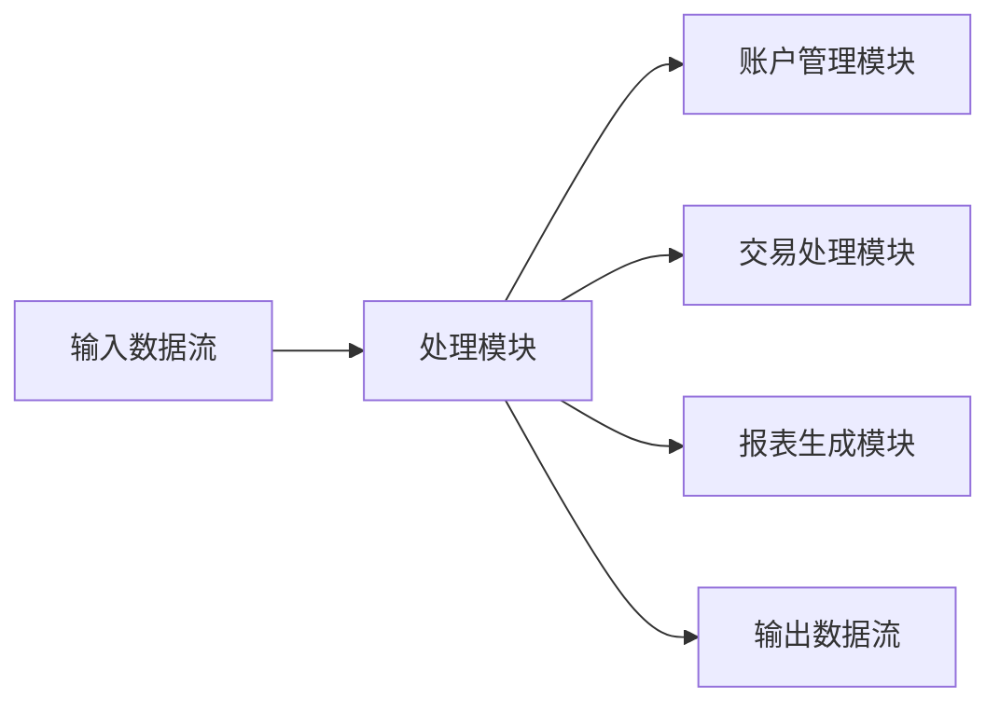
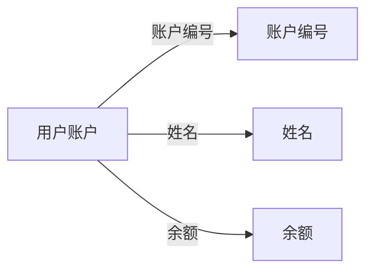
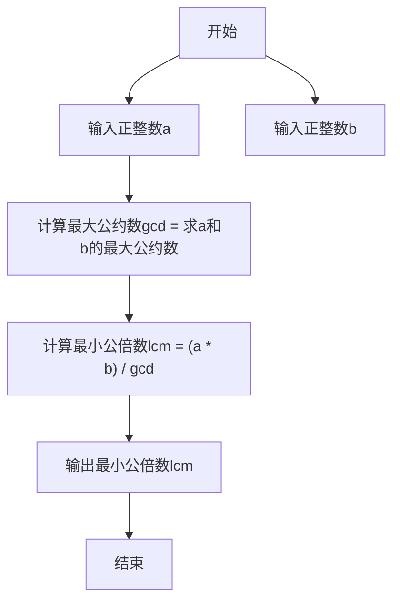
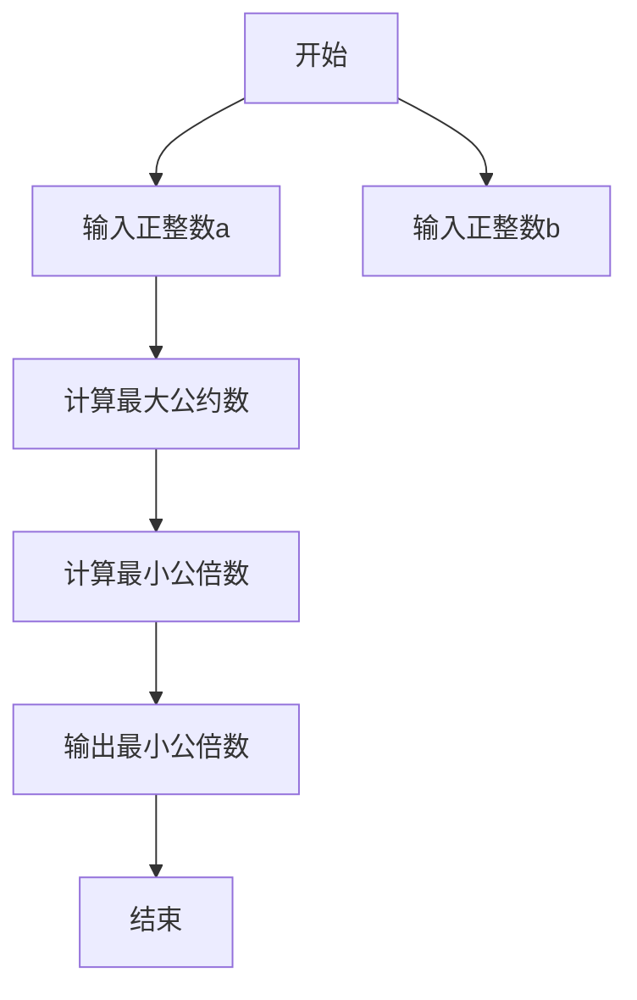
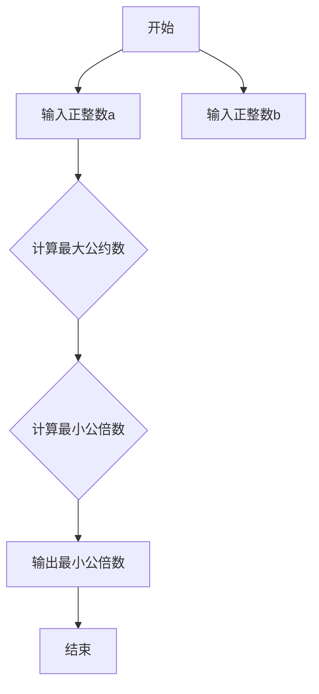
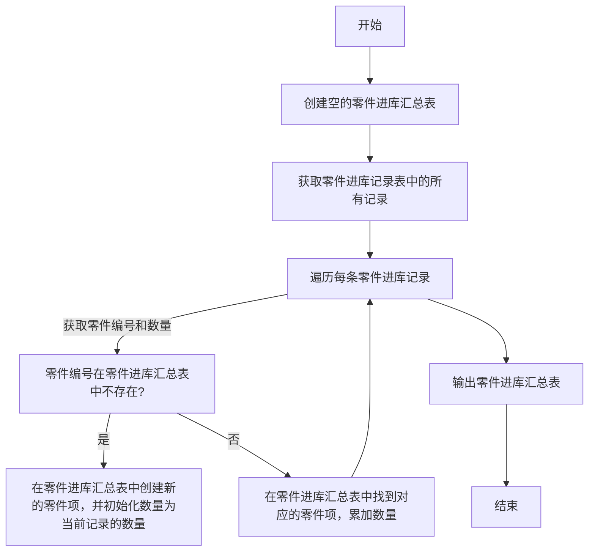
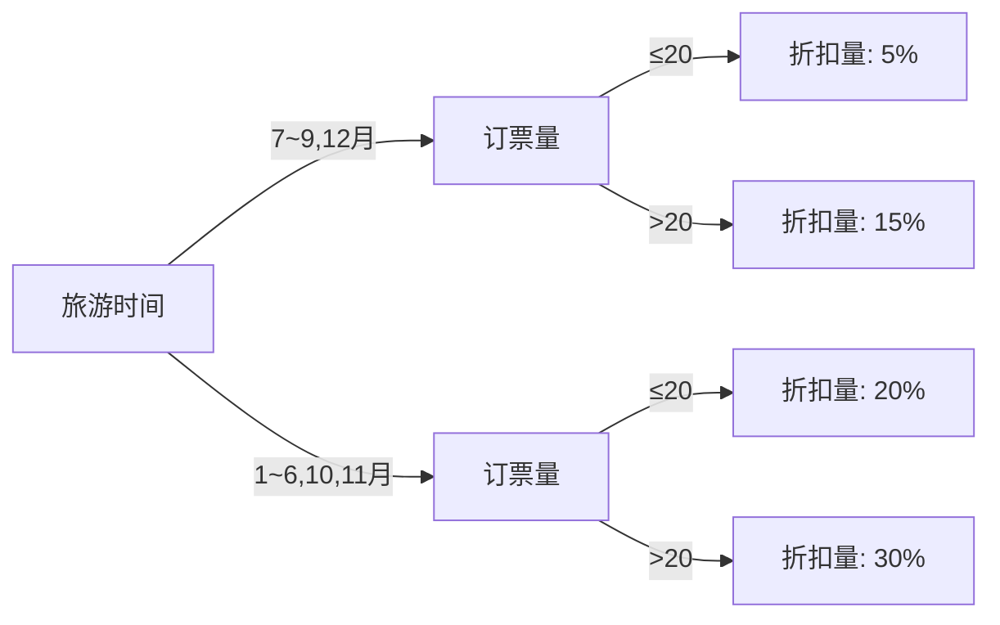

```mermaid
graph LR
A[输入数据流] --> B[处理模块]
B --> C[账户管理模块]
B --> D[交易处理模块]
B --> E[报表生成模块]
B --> F[输出数据流]
```

```mermaid
graph LR
A[用户账户] --> |账户编号| B[账户编号]
A --> |姓名| C[姓名]
A --> |余额| D[余额]

```

```mermaid
graph TB
A[开始] --> B[输入正整数a]
A --> C[输入正整数b]
B --> D[计算最大公约数gcd = 求a和b的最大公约数]
D --> E["计算最小公倍数lcm = (a * b) / gcd"]
E --> F[输出最小公倍数lcm]
F --> G[结束]
```

```mermaid
graph TB
A[开始] --> B[输入正整数a]
A --> C[输入正整数b]
B --> D[计算最大公约数]
D --> E[计算最小公倍数]
E --> F[输出最小公倍数]
F --> G[结束]
```

```mermaid
graph TB
A[开始] --> B[输入正整数a]
A --> C[输入正整数b]
B --> D{计算最大公约数}
D --> E{计算最小公倍数}
E --> F[输出最小公倍数]
F --> G[结束]

```

```mermaid
graph TB
A[开始] --> B[创建空的零件进库汇总表]
B --> C[获取零件进库记录表中的所有记录]
C --> D[遍历每条零件进库记录]
D --> |获取零件编号和数量| E["零件编号在零件进库汇总表中不存在?"]
E --> |是| F["在零件进库汇总表中创建新的零件项，并初始化数量为当前记录的数量"]
E --> |否| G["在零件进库汇总表中找到对应的零件项，累加数量"]
G --> D
D --> H[输出零件进库汇总表]
H --> I[结束]

```

| 旅游时间    | 订票量 ≤20 | 订票量 >20 |
|-------------|------------|-----------|
| 7~9,12月   | 5%         | 15%       |
| 1~6,10,11月 | 20%        | 30%       |

```mermaid
graph LR
A[旅游时间] --> |"7~9,12月"| B[订票量]
A --> |"1~6,10,11月"| C[订票量]
B --> |"≤20"| D["折扣量: 5%"]
B --> |">20"| E["折扣量: 15%"]
C --> |"≤20"| F[折扣量: 20%]
C --> |">20"| G[折扣量: 30%]

```
