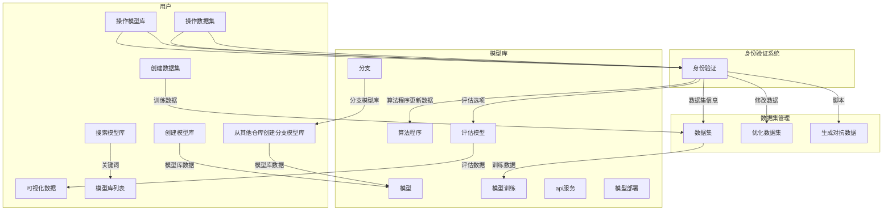

```mermaid
graph TD
subgraph 用户
    A[创建模型库]
    B[搜索模型库]
    C[从其他仓库创建分支模型库]
    D[创建数据集]
    E[可视化数据]
    F[操作模型库]
    G[操作数据集]
    U[模型库列表]
end

subgraph 模型库
	H[模型]
	I[算法程序]
	J[评估模型]
	K[模型训练]
	L[api服务]
	M[模型部署]
	T[分支]
end

subgraph 身份验证系统
	S[身份验证]
end

subgraph 数据集管理
	P[数据集]
	Q[优化数据集]
	R[生成对抗数据]
end

A -->|模型库数据|H
B -->|关键词|U
T -->|分支模型库|C
C -->|模型库数据|H
D -->|训练数据|P
F --> S
S -->|算法程序更新数据|I
S -->|评估选项|J
J -->|评估数据|E
F --> S
S -->|数据集信息|P
P -->|训练数据|K
G -->S
S --> |修改数据|Q
G --> S
S --> |脚本|R
```
