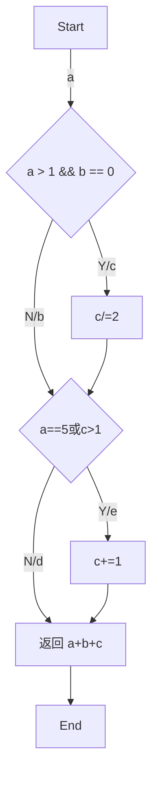
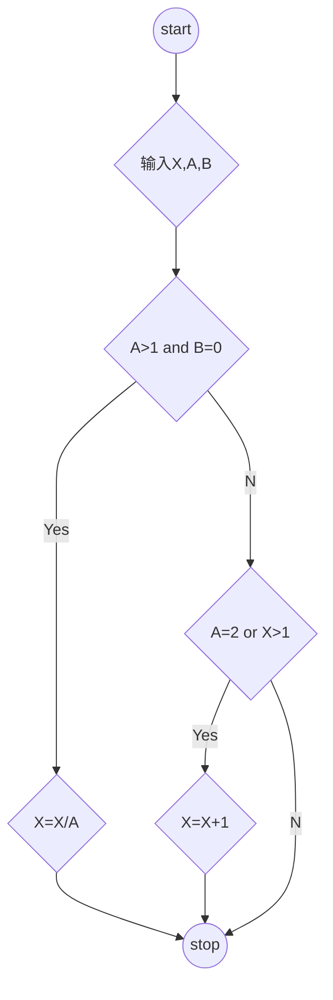

## 实验目的

## 实验原理
## 实验过程
### 题目一：使用逻辑覆盖测试方法测试以下程序段
```go
func Function(a, b, c int) int {
	if a > 1 && b == 0 {
		c /= a
	}
	if a == 5 || c > 1 {
		c += 1
	}
	return a + b + c
}
```

#### 画出程序控制流图（用题中给出的语句编号表示）



#### 语句覆盖
	语句覆盖（在语句覆盖测试用例中，使程序中每个可执行语句至少被执行一次。）
- 测试用例

| 测试用例  | 覆盖路径 | 预期结果 |
|----------|---------|----------|
| a=2,b=0,c=4 | a,c,e | 5 |

#### 判定覆盖

	判定覆盖(使得每个判定语句的取值都满足各有一次“真”与“假”)
- 测试用例

| 测试用例 | 覆盖路径 | 预期结果 |
| --- | --- | --- |
| a=2,b=0,c=4 | a, c, e | 5 |
| a=-4, b=3, c=-5 | a, b, d | -6 |
| a=3, b=0, c=-6 | a, c, d | 1 |
| a=5, b=1, c=0| a, b, e | 7 |

#### 条件覆盖
	设计测试用例时，要保证每种状态都至少出现一次。设计测试用例的原则是尽量以最少的测试用例达到最大的覆盖率
- 条件列表

| 条件一 | 条件标记 | 条件二 | 条件标记 |
|--------|---------|--------|---------|
| a>1    | S1      | b=0    | S3      |
| a<=1   | -S1     | b!=0   | -S3     |
| a=5    | S2      | c>1    | S4      |
| a!=5   | -S2     | c<=1   | -S4     |

- 测试用例

| 测试用例 | 条件标记 | 执行路径 | 预期结果 |
| --- | --- | --- | --- |
| a=2,b=0,c=4 | S1, -S2, S3, S4 | a, c, e | 5 |
| a=-4, b=3, c=-5 | -S1,-S2,-S3,-S4 | a, b, d | -6 |
| a=3, b=0, c=-6 | S1,- S2, S3, -S4 | a, c, d | 1 |
| a=5, b=1, c=0| S1, S2, -S3, -S4| a, b, e | 7 |
#### 判断/条件覆盖
	设计用例，使得判断中的每个条件的所有可能结果至少出现一
	次，而且判断本身所有可能结果也至少出现一次
| 测试用例 | 条件标记 | 执行路径 | 预期结果 |
| --- | --- | --- | --- |
| a=2,b=0,c=4 | S1, -S2, S3, S4 | a, c, e | 5 |
| a=-4, b=3, c=-5 | -S1,-S2,-S3,-S4 | a, b, d | -6 |
| a=3, b=0, c=-6 | S1,- S2, S3, -S4 | a, c, d | 1 |
| a=5, b=1, c=0| S1, S2, -S3, -S4| a, b, e | 7 |
#### 条件组合覆盖
	1. 设计足够多的测试用例，使判定语句中每个条件的所有可能至少出现一次，并且每个判定语句本身的判定结果也至少出现一次   
	2. 由于四个条件每个条件都有取“真”、“假”两个值，因此所有条件结果的组合有24=16种
|  序号    |  组合              | 测试用例           | 预期结果 |
|:-------|:-----------------|:---------------|:-----|
|  1     |  S1，S2，S3，S4     | a=5 ,b=0 c=2   |    6 |
|  2     |  -S1，S2，S3，S4    | 不可能            |      |
|  3     |  S1，-S2，S3，S4    |  a=2, b=0, c=2 |    3 |
|  4     |  S1，S2，-S3，S4    | a=5, b=1, c=2  |    9 |
|  5     |  S1，S2，S3，S4     | a=5, b=0, c=1  |    6 |
|  6     |  -S1，-S2，S3, S4  |  a=1, b=0, c=2 |    4 |
|  7     |  -S1，S2，-S3，S4   | 不可能            |      |
|  8     |  -S1，S2，S3，-S4   | 不可能            |      |
|  9     |  S1，-S2，-S3，S4   | a=2, b=1, c=2  |    6 |
|  10    |  S1，S2，-S3，-S4   | a=5,b=1,c=1    |    8 |
|  11    |  S1，-S2，S3，-S4   |  a=2, b=0, c=1 |    2 |
|  12    |  -S1，-S2，-S3，S4  |  a=1, b=1, c=2 |    5 |
|  13    |  -S1，-S2，S3，-S4  |  a=1, b=0, c=1 |    2 |
|  14    |  S1，-S2，-S3，-S4  |  a=3, b=2, c=1 |    6 |
|  15    |  -S1，S2，-S3，-S4  | 不可能            |      |
|  16    |  -S1，-S2，-S3，-S4 |  a=1, b=1, c=1 |    3 |  
#### 测试程序
```go
package whitebox

import (
	"testing"
)

func TestFunction_1(t *testing.T) {
	testCases := []struct {
		a, b, c int
		expectedResult int
	}{
		// 语句覆盖
		{2, 0, 4, 5},
		// 判定覆盖
		{2, 0, 4, 5},
		{-4, 3, -5, -6},
		{3, 0, -6, 1},
		{5, 1, 0, 7},
		// 条件覆盖
		{2, 0, 4, 5},
		{-4, 3, -5, -6},
		{3, 0, -6, 1},
		{5, 1, 0, 7},
		// 判定-条件覆盖
		{2, 0, 4, 5},
		{-4, 3, -5, -6},
		{3, 0, -6, 1},
		{5, 1, 0, 7},
		// 条件组合覆盖
		{5, 0, 2, 6},
		{2, 0, 2, 3},
		{5, 1, 2, 9},
		{5, 0, 1, 6},
		{1, 0, 2, 4},
		{2, 1, 2, 6},
		{5, 1, 1, 8},
		{2, 0, 1, 2},
		{1, 1, 2, 5},
		{1, 0, 1, 2},
		{3, 2, 1, 6},
		{1, 1, 1, 3},
	}

	for _, tc := range testCases {
		if res := Function_1(tc.a , tc.b, tc.c); res != tc.expectedResult {
			t.Errorf("Function_1(%d, %d, %d); 期望输出 %d; 实际输出 %d", tc.a, tc.b, tc.c, tc.expectedResult, res)
		}
	}
}
```
### 题目二：使用基本路径测试方法，为以下程序段设计测试用例。 
```go
package whitebox

func Do(x, a, b int) int {
	if a > 1 && b == 0 {
		x = x / a
	}
	if a == 2 || x > 1 {
		x = x + 1
	}
	return x
}
```
### 程序流程图


